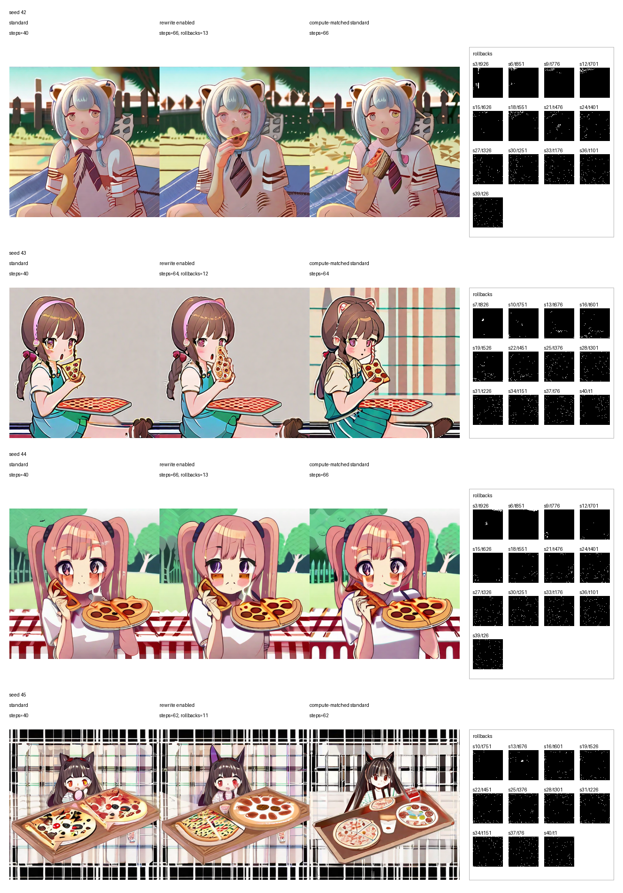

# sd-rollback-rewrite

（LLMがうまいこと書いてくれたよ！）

Stable Diffusion / SDXL で、local rollback + rewrite を使った生成比較を行う実験ツールです。

基本的な考え方は、連続した step の denoising で latent が局所的に大きく書き換わっている領域を、局所的な不安定さ・混乱・破綻の前兆として捉えることです。そうした領域が連続して観測されたとき、その周辺だけを rollback し、local rewrite を試みます。

つまり、画像全体をやり直すのではなく、「怪しい場所だけを巻き戻して書き直す」ための実験系です。

同じ初期ノイズから、次の 3 系列を並べて比較できます。

- standard: 通常の denoising
- rewrite enabled: 局所 rollback / rewrite を許した生成
- compute-matched standard: rewrite で実際に消費した step 数に合わせた通常生成

rewrite enabled の列には、右側に rollback 発火 step と mask も表示されます。



この画像は次のコマンドで得られたものです。

```powershell
uv run python -m sd_rollback_rewrite --prompt "A nekomimi pigtails hair girl eats a slice of pizza on picnic." --device cuda --batch-size 4 --model-family sdxl --low-vram --width 512 --height 512
```

## Requirements

- Python 3.14+
- CUDA を使う場合は PyTorch / driver の対応環境
- 依存関係は [pyproject.toml](pyproject.toml) を参照

セットアップ例:

```powershell
uv sync
```

## Usage

基本形:

```powershell
uv run python -m sd_rollback_rewrite --prompt "A red apple on a table"
```

SDXL を low VRAM 設定で回す例:

```powershell
uv run python -m sd_rollback_rewrite --model-family sdxl --model "stabilityai/stable-diffusion-xl-base-1.0" --prompt "A nekomimi pigtails hair girl eats a slice of pizza on picnic." --negative-prompt "bad anatomy, blurry" --device cuda --low-vram --width 512 --height 512
```

出力先は既定で `outputs/sd_rollback_rewrite.png` です。`--output` で変更できます。

## Model Families

### sd15

- 既定 model: `stable-diffusion-v1-5/stable-diffusion-v1-5`
- 既定 steps: `30`
- 既定 guidance scale: `7.5`

### sdxl

- 既定 model: `stabilityai/stable-diffusion-xl-base-1.0`
- 既定 steps: `40`
- 既定 guidance scale: `5.0`
- `--low-vram` で VAE slicing と CPU offload を有効化可能

`--model-family` を省略した場合は、`--model-id` / `--model` の文字列から推定します。

## Important Options

- `--prompt`: 生成プロンプト
- `--negative-prompt`: negative prompt
- `--model-family {sd15,sdxl}`: モデルファミリ選択
- `--model` / `--model-id`: Hugging Face model id
- `--device {cuda,cpu}`: 実行デバイス
- `--num-samples`: 比較する seed 数。互換のため `--batch-size` も使用可能
- `--low-vram`: CUDA 時に low VRAM モードを有効化
- `--steps`: denoising step 数
- `--rollback-steps`: rollback 幅
- `--substeps`: replay 内 substep 数
- `--delta-percentile`: 異常検知閾値 percentile
- `--trigger-run-length`: rollback 発火に必要な連続異常 step 数
- `--max-rollbacks`: 1 サンプルあたりの rollback 上限
- `--rewrite-noise-strength`: rewrite 領域へ入れる新ノイズ強度

## Notes

- `--num-samples` はモデルへ同時投入する batch size ではなく、seed を変えて順番に生成する枚数です。
- SDXL は decode 時に VAE の upcast が必要になることがあるため、その処理を含めています。
- rollback / rewrite の既定ハイパーパラメータは `sd15` と `sdxl` で分かれています。

## Help

利用可能な全オプションは次で確認できます。

```powershell
uv run python -m sd_rollback_rewrite --help
```